# SearchPV Visual Data-Flow Map

**Scope:** SearchPV Next.js repository and the current Supabase metadata snapshot supplied in July 2026.

This document is deliberately visual and high level. It answers:

- What database objects feed each feature?
- Which Next.js files query those objects?
- Which components receive the results?
- What page, report, chart, table, or export is produced?

Detailed business rules should remain as comments beside the relevant code.

---

## 1. Master SearchPV Flow

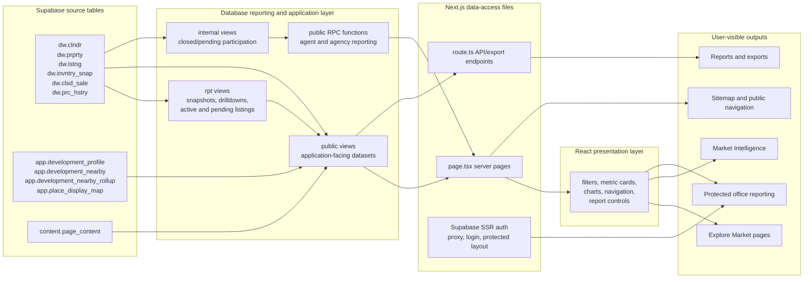

---

## 2. Market Exploration and Home Page

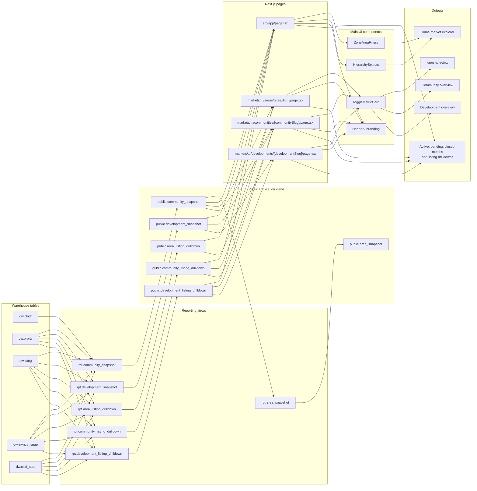

---

## 3. Development Profile and Nearby Places

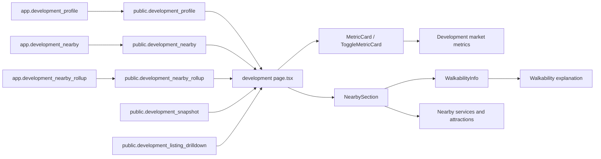

**Page file**

```text
src/app/markets/[marketSlug]/areas/[areaSlug]/communities/[communitySlug]/developments/[developmentSlug]/page.tsx
```

---

## 4. Public Closed-Sales Analytics

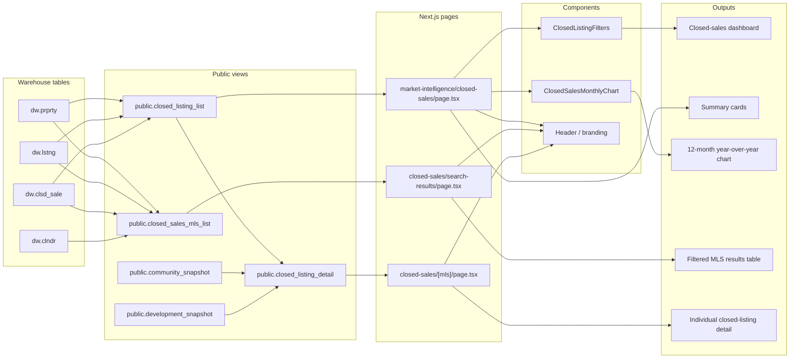

---

## 5. Active-Listings Report and Exports

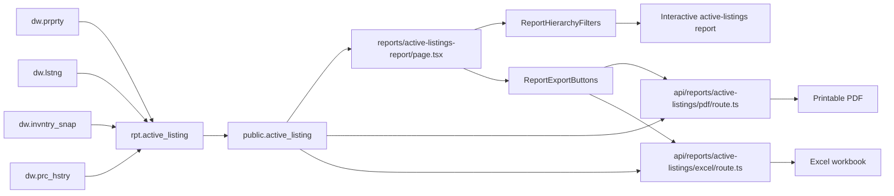

**Important:** This is currently the only mapped public report that directly depends on `dw.prc_hstry`.

---

## 6. Protected Office Agency Reporting

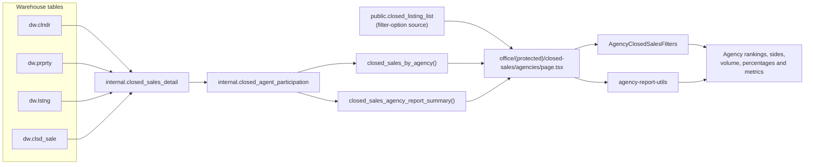

---

## 7. Protected Office Agent Reporting

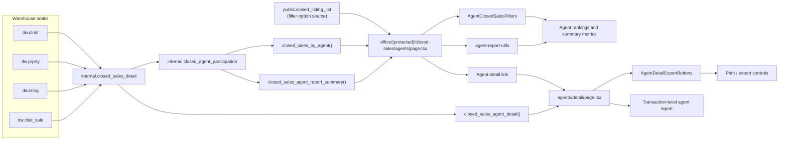

---

## 8. Authentication and Protected Routes

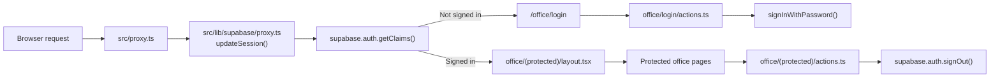

The office protection is enforced at the server layout/proxy layer, not only by hiding navigation links.

---

## 9. Content and Older Standalone Area/Development Routes

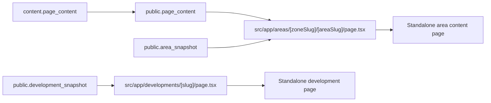

These coexist with the newer hierarchical routes under:

```text
/markets/[marketSlug]/areas/[areaSlug]/communities/[communitySlug]/developments/[developmentSlug]
```

That distinction is useful when reviewing possible route consolidation or cleanup.

---

## 10. Sitemap Flow

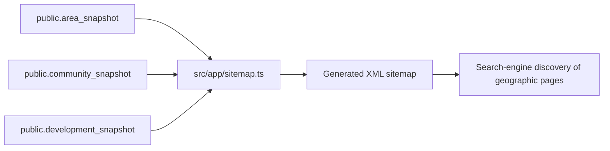

---

## 11. Compact Where-Used Index

| Database object | Direct application consumers | Main output |
|---|---|---|
| `public.community_snapshot` | Home, area, community pages, sitemap | Geographic options and market summaries |
| `public.area_snapshot` | Standalone area page, sitemap | Area page and area URLs |
| `public.development_snapshot` | Home, community, development pages, sitemap | Development summaries and URLs |
| `public.area_listing_drilldown` | Home and area pages | Listing-level area drilldown |
| `public.community_listing_drilldown` | Home, area and community pages | Listing-level community drilldown |
| `public.development_listing_drilldown` | Home, community and development pages | Listing-level development drilldown |
| `public.development_profile` | Hierarchical development page | Descriptive development profile |
| `public.development_nearby` | Hierarchical development page | Nearby-place details |
| `public.development_nearby_rollup` | Hierarchical development page | Nearby category summaries |
| `public.closed_listing_list` | Closed-sales dashboard; office filter options | Public sales analytics and office filters |
| `public.closed_sales_mls_list` | Closed-sales search-results page | Detailed filtered sales table |
| `public.closed_listing_detail` | Closed-sale MLS detail page | Individual sale detail |
| `public.active_listing` | Active-listings page, PDF route, Excel route | Interactive and exported report |
| `public.page_content` | Standalone area page | Editorial area content |
| `closed_sales_by_agency()` | Protected agency page | Agency ranking dataset |
| `closed_sales_agency_report_summary()` | Protected agency page | Agency report totals |
| `closed_sales_by_agent()` | Protected agent page | Agent ranking dataset |
| `closed_sales_agent_report_summary()` | Protected agent page | Agent report totals |
| `closed_sales_agent_detail()` | Protected agent-detail page | Transaction-level agent history |

---

## 12. Current Security Shape

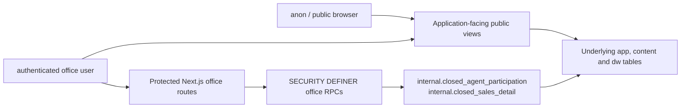

Current metadata observations:

- No RLS policies were returned for the selected SearchPV schemas.
- No custom triggers were returned.
- RLS is disabled on the 19 underlying application tables included in the export.
- The five office sales RPCs are `SECURITY DEFINER`.
- Those five RPCs have a fixed `search_path` of `public, internal, pg_temp`.
- Final exposure therefore depends heavily on grants, public views, RPC execution privileges, and the Next.js server-side auth boundary.

This is a flow description, not yet a full security verdict.

---

## 13. Files That Directly Touch Supabase

| File | Reads/calls |
|---|---|
| `src/app/api/reports/active-listings/excel/route.ts` | `active_listing` |
| `src/app/api/reports/active-listings/pdf/route.ts` | `active_listing` |
| `src/app/areas/[zoneSlug]/[areaSlug]/page.tsx` | `area_snapshot`, `page_content` |
| `src/app/developments/[slug]/page.tsx` | `development_snapshot` |
| `src/app/market-intelligence/closed-sales/[mls]/page.tsx` | `closed_listing_detail` |
| `src/app/market-intelligence/closed-sales/page.tsx` | `closed_listing_list` |
| `src/app/market-intelligence/closed-sales/search-results/page.tsx` | `closed_sales_mls_list` |
| `src/app/markets/[marketSlug]/areas/[areaSlug]/communities/[communitySlug]/developments/[developmentSlug]/page.tsx` | `development_listing_drilldown`, `development_nearby`, `development_nearby_rollup`, `development_profile`, `development_snapshot` |
| `src/app/markets/[marketSlug]/areas/[areaSlug]/communities/[communitySlug]/page.tsx` | `community_listing_drilldown`, `community_snapshot`, `development_listing_drilldown`, `development_snapshot` |
| `src/app/markets/[marketSlug]/areas/[areaSlug]/page.tsx` | `area_listing_drilldown`, `community_listing_drilldown`, `community_snapshot` |
| `src/app/office/(protected)/closed-sales/agencies/page.tsx` | `closed_listing_list`, `closed_sales_agency_report_summary()`, `closed_sales_by_agency()` |
| `src/app/office/(protected)/closed-sales/agents/detail/page.tsx` | `closed_sales_agent_detail()` |
| `src/app/office/(protected)/closed-sales/agents/page.tsx` | `closed_listing_list`, `closed_sales_agent_report_summary()`, `closed_sales_by_agent()` |
| `src/app/page.tsx` | `area_listing_drilldown`, `community_listing_drilldown`, `community_snapshot`, `development_listing_drilldown`, `development_snapshot` |
| `src/app/reports/active-listings-report/page.tsx` | `active_listing` |
| `src/app/sitemap.ts` | `area_snapshot`, `community_snapshot`, `development_snapshot` |


---

## 14. Maintenance Rule

Update this map only when a change alters one of these connections:

1. A page or API route starts or stops querying a database object.
2. A view or RPC changes its upstream tables/views.
3. A component becomes responsible for a new major output.
4. A report or export endpoint is added, removed, or replaced.
5. The authentication boundary for an office route changes.

Small styling changes, local calculations, and ordinary refactoring do not require a map update.